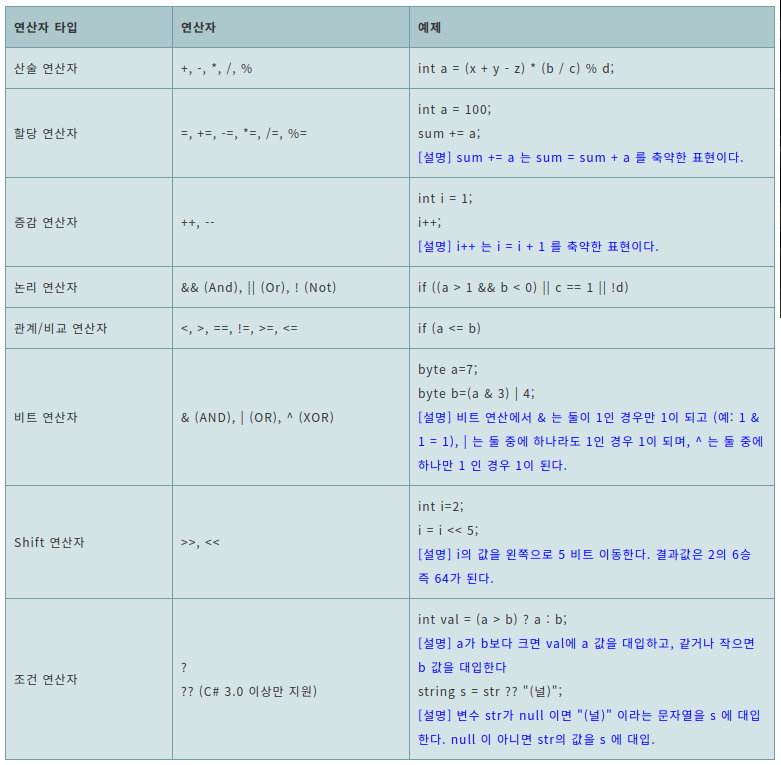
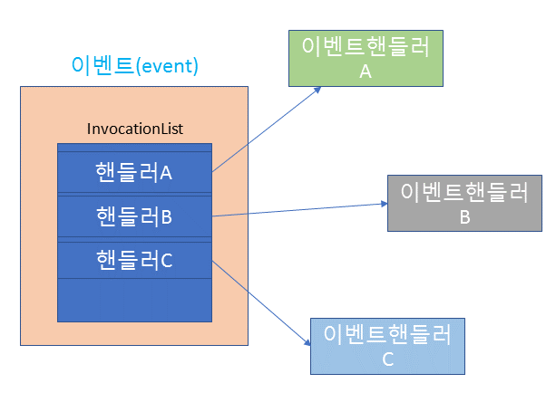

# C# Study
[C# Study](https://www.csharpstudy.com/)

## 1. C# program source code example
      namespace Intro_Ex1
      {
          class Program   
              {
                  static void Main(string[] args)
                      {
                          System.Console.WriteLine("Hello Wrold!");
                          
                          // 한 줄 코멘트
  
                          /*
                              두 줄 이상의 코멘트
                              두 줄 이상의 코멘트
                          */
                      }
              }
      }

- namespace는 scope와 비슷한 역할을 하며, 다른 namespace에 있는 변수를 사용하려면 using으로 삽입해야 한다.
- 모든 C# 프로그램은 Main() 이라는 시작 메서드를 가져야한다.  
- Main메소드는 임의의 클래스 안에 존재하며 프로그램 상ㅇ에 단 1개만 존재해야 한다.
- Main메소드는 static으로 선언되며, 메소드 인자는 string[] 문자열 이다.
- System.Console은 .NET Framework 클래스이며, WriteLine은 화면에 데이터를 출력하는 메서드이다.

 

## 2. data type
- C#을 포함한 모든 .NET 프로그래밍 언어는 .NET의 Common Type System에 정의된 데이터 타입을 사용한다.
- 사용자는 C# 데이터 타입과 .NET 데이터 타입 모두 표현이 가능하지만, 컴파일러는 C# 데이터 타입을 .NET 데이터 타입으로 변경한다.

| .NET 데이터 타입      | C# 데이터 타입 | 설명                              |
|------------------|-----------|---------------------------------|
| System.Boolean   | bool      | True or False                   |
| System.Byte      | byte      | 8bit unsigned integer (부호 없는)   |
| System.SByte     | sbyte     | 8bit signed integer (부호 있는)     |
| System.Int16     | short     | 16bit signed integer            |
| System.Int32     | int       | 32bit signed integer            |
| System.Int64     | long      | 64bit signed integer            |
| System.UInt16    | ushort    | 16bit unsigned integer          |
| System.UInt32    | unint     | 32bit unsigned integer          |
| System.UInt64    | ulong     | 64bit unsigned integer          |
| System.Single    | float     | 32bit single precision 부동소숫점 숫자 |
| System.Double    | double    | 64bit double precision 부동소숫점 숫자 |
| System.Decimal   | decimal   | 128bit Decimal (정확한 숫자 저장에 사용)  |
| System.Char      | char      | 16bit 유니코드 문자 (' ')             |
| System.String    | string    | 유니코드 문자열 (" ")                  |
| System.DateTime  |           | 날짜와 시간                          |
| System.Object    | object    | 모든 타입의 기본 클래스로 모든 유형을 포함할 수 있음  |

#### 디폴트 리터럴 타입
- 리터럴(literal) 데이터: 변수에 넣지 않은 데이터 그 자체를 의미, (변수 대입 시 등호 오른쪽)
- C#에서 별도의 접미어(Suffix)가 없는 경우 int, double, char, string, bool 타입으로 값 할당
######
      123     // int
      12.3    // double
      "A"     // string
      'a'     // char
      true    // bool
#### Suffix
      1024L   // long
      1024U   // uint
      1024UL  // ulong
      10.24F  // float
      10.24D  // double
      10.24M  // decimal

#### 예제
      // Bool
      bool b = true;
      
      // Numeric
      short sh = -32768;   
      int i = 2147483647;  
      long l = 1234L;      // L suffix
      float f = 123.45F;   // F suffix
      double d1 = 123.45;
      double d2 = 123.45D; // D suffix
      decimal d = 123.45M; // M suffix
      
      // Char/String
      char c = 'A';
      string s = "Hello";
      
      // DateTime  2011-10-30 12:35
      DateTime dt = new DateTime(2011, 10, 30, 12, 35, 0);
  
      // 해당 데이터 타입의 최대값과 최소값
      int i = int.MaxValue;
      float f = float.Minvalue;

#### NULL
- 어떤 변수가 메모리 상에 어떤 데이터도 가지고 있지 않다는 의미로 null을 사용한다.
- 모든 타입이 null을 가질 수 있는 것은 아니다. Reference 타입은 null을 가질 수 있고, Value 타입은 가질 수 없다.

#### Nullable Type
- 기본적으로 정수나 날짜와 같은 Value Type은 null을 가질 수 없다. 
- 그러나 C# 2.0에서 부터 이러한 타입들도 null을 가질 수 있게 하였는데, 이를 Nullable Type이라 한다.
- C#에서 물음표(?)를 데이터 타입명 뒤에 붙이면 Nullable Type이 된다.

 

## 3. 변수와 상수

### 변수
- 지역 변수: 메서드 안에서 해당 메서드의 로컬 변수로 선언된 변수이다.
  해당 메서드 내에서망 사용되고, 메서드 호출이 끝나면 소멸한다.
- 전역 변수(필드): 클래스 안에서 선언되어 클래스 내의 멤버들이 사용하는 변수이다.  
  클래스의 객체가 살아있는 한 존속하며 다른 메서드들에서 필드 참조할 수 있다.
- 정적 필드: static으로 선언된 필드, 클래스 Type 처음 런타임에 의해 로드될 때 해당 Type 객체에 생성되어 프로그램이 종료될 때 까지 유지된다.
######
      using System;
      
      namespace ConsoleApplication1
      {
      class CSVar
      {
      //필드 (클래스 내에서 공통적으로 사용되는 전역 변수)
      int globalVar;
      const int MAX = 1024;
      
              public void Method1()
              {
                  // 로컬변수
                  int localVar;
      
                  // 아래 할당이 없으면 에러 발생
                  localVar = 100;
      
                  Console.WriteLine(globalVar);
                  Console.WriteLine(localVar);
              }
          }
      
          class Program
          {
              // 모든 프로그램에는 Main()이 있어야 함.
              static void Main(string[] args)
              {
                  // 테스트
                  CSVar obj = new CSVar();
                  obj.Method1();
              }
          }
      }

### 상수
- C#에서 상수는 C# 변수 앞에 const를 붙여 정의한다.
- 상수와 변수의 차이점은 변수는 값을 변경할 수 있지만, 상수는 초기에 정한 값을 변경할 수 없다.
- C# const 대신 readonly 키워드를 사용하여 읽기전용 필드를 만들 수 있다.(개념적으로 상수와 비슷)
- const는 컴파일 시 상수값이 결정되고, readonly는 런타임 시 그 값이 결정된다.
- readonly 키워드를 사용하면 해당 변수 또는 필드가 선언되었을 때 또는 클래스의 생성자에서만 값을 할당할 수 있다.  
  이는 변수가 불편(immutable)하다는 의미를 갖는다. (참조 데이터 내부 요소 수정은 가능)
######
      using System;
      
      namespace ConsoleApplication1
      {
      class CSVar
      {
      // 상수
      const int MAX_VALUE = 1024;
      
              // readonly 필드 
              readonly int Max;
              public CSVar() 
              {
                 Max = 1;
              }
              
              //...
          }
      }

 

## 4. 배열(Array)
- 배열: 동일한 데이터 타입 요소들로 구성된 데이터 집합으로서, 인덱스를 통해 개별 요소에 접근할 수 있다.
- C#은 최대 32차 배열까지 가질 수 있다. 
- 2차원 이상의 다차원 배열은 각 차원별 요소 크기가 고정된 'Rectangular 배열'과 각 차원별 크기가 서로 다른 '가변 배열'로 나눌 수 있다.  
- **주의!** 배열의 선언은 대괄호([ ])를 사용하지만, 요소를 정의할 땐 중괄호({ })를 사용한다.
### Rectangular 배열 예제
      // 1차 배열
      string[] players = new string[10];
      string[] Regions = { "서울", "경기", "부산" };
      System.Console.WriteLine(players[0]);
      System.Console.WriteLine(Regions[0]);
    
      // 2차 배열 선언 및 초기화
      string[,] Depts = {{"김과장", "경리부"},{"이과장", "총무부"}};
      System.Console.WriteLine(Depts[1,1]);
      
      // 3차 배열 선언(선언만 한 경우에 0으로 초기화X)   
      string[,,] Cubes;
- 다차원 배열에서 각 차원 배열의 요소 크기가 동일한 'Rectangular 배열'은 [ , ]와 같이 표현한다.
- 배열에 접근할 때에도 마찬가지이다. 

### 가변 배열 예제
      //Jagged Array (가변 배열)
      //1차 배열 크기(3)는 명시해야
      int[][] A = new int[3][];
      
      //각 1차 배열 요소당 서로 다른 크기의 배열 할당 가능
      A[0] = new int[2];
      A[1] = new int[3] { 1, 2, 3 };
      A[2] = new int[4] { 1, 2, 3, 4 };
      
      A[0][0] = 1;
      A[0][1] = 2
- 각 차원별 배열 요소 크기가 가변적인 가변 배열의 경우[ ][ ]처럼 각 차원마다 별도의 대괄로를 사용한다.
- 첫번째 차원의 크기는 컴파일 타임에 확정되어야하고, 그 이상 차원은 런타임시 동적으로 서로 다른 크기의 배열로 지정할 수 있다.
- 가변 배열은 고정된 크기를 사용하면 메모리 낭비가 심한 경우 사용한다.

### 배열의 사용
- 모든 배열은 .NET Framework의 System.Array에서 파생되기 때문에 System.Array의 메서드, 프로퍼티를 사용할 수 있다.
- C#에서 배열 전체를 전달하기 위해서는 보내는 쪽에서는 배열명을 사용하고, 받는 쪽에서는 동일한 배열 타입의 배열을 받아들이면 된다. 
- 배열은 레퍼런스(Referuence)타입이기 때문에, 배열을 다른 객체나 메서드에 전달할 때, 직접 모든 배열 데이터를 복사하지 않고, 배열 전체를 가리키는 참조 값만을 전달한다.  
######
        static void Main(string[] args)
        {            
          int[] scores = { 80, 78, 60, 90, 100 };
          int sum = CalculateSum(scores); // 배열 전달: 배열명 사용
          Console.WriteLine(sum);        
        }
      
        static int CalculateSum(int[] scoresArray) // 배열 받는 쪽
        {
          int sum = 0;
          for (int i = 0; i < scoresArray.Length; i++)
          {
            sum += scoresArray[i];
          }
          return sum;
        }

 

## 5. 문자열
- string은 쌍따옴표(" ")로 표현하고, char는 따옴표(' ')로 표현한다.
- C#에서 문자열은 Immutable Type 이다. 즉, 한 번 문자열이 설정되면 다시 변경할 수 없다.  
  (s = "apple"; 이라고 선언하고 s = "apply";로 바꾸면 새로운 string객체를 생성하여 s에 할당)
######
        static public void ex03_string1()
        {
            string s1 = "C#";
            string s2 = "Programing";
      
            char c1 = 'A';
            char c2 = 'B';
              
            //문자열 결합
            string s3 = s1 + " " + s2;
            Console.WriteLine("string: {0}", s3);
      
            // 문자열 슬라이싱
            string s3substring = s3.Substring(1, 5);
            Console.WriteLine("Substring: {0}", s3substring);
        }

- 문자열은 문자의 집합체이다. 문자열 안에 있는 각 문자에 엑세스 하고 싶으면 인덱스를 사용한다. 
- 문자배열(char array)을 문자열(string)으로 변환하기 위해서는 new string을 사용한다.
- 하나의 문자는 상응하는 ASCII 코드 값을 가진다. 하나의 문자는 숫자 값으로 표현되므로 문자에 숫자를 더하거나 빼면 다른 문자로 표현 가능하다.
######
      static public void ex03_string2()
      {
          string s = "C# Studies";
          
          // 문자열을 배열인덱스로 한문자 엑세스
          for (int i = 0; i < s.Length; i++)
          {
              Console.WriteLine("{0}: {1}", i, s[i]);
          }
          
          // 문자열을 문자배열로 변환
          string str = "Hello";
          char[] charArray = str.ToCharArray();
          Console.WriteLine(charArray);
          
          // 문자배열을 문자열로 변환
          char[] charArray2 = { 'A', 'B', 'C', 'D' };
          s = new string(charArray2);
          Console.WriteLine(s);
          
          // 문자 연산
          char c1 = 'A';
          char c2 = (char)(c1 + 3);
          Console.WriteLine(c2);  // D 출력
      }
### C# StringBuilder 클래스
- String은 Immutable Type 이기 때문에, 문자열 갱신을 많이 하는 프로그램에는 적합하지 않다.
- 반면 Mutable Type인 StringBuilder 클래스는 문자열 갱신이 많은 곳에 적합하다.  
- 이는 이 클래스가 별도 메모리를 생성, 소멸하지 않고 일정한 버퍼를 갖고 문자열 갱신을 효율적으로 처리하기 때문이다.
- 특히 루프 안에서 계속 문자열을 추가 변경하는 코드에서는 string 대신 StringBuilder를 사용해야 한다.

 

## 6. 열거형 enum
enum은 여러개의 상수를 하나의 컨테이너에서 관리하기 위해 사용하는 자료형이다. 
기본적으로 열거형 멤버의 연결된 상수 값은 int형식이다. 0으로 시작하고 정의 텍스트 순서에 따라 1씩 증가한다. 다른 정수 숫자 형식을 열거형 형식의 기본 형식으로 명시적으로 지정할 수 있다.

    enum Season
    {
      Spring, // 0
      Summer, // 1
      Autumn, // 2
      Winter  // 3
    }

### 6-2. enum의 사용
enum 타입은 숫자형 타입과 호환이 가능하다. 만약 enum 타입의 변수를 int로 캐스팅(주:Casting - 한 타입을 다른 타입으로 변경하는 것, 타입 변환이 실패할 수도 있다.)하면 해당 enum값의 숫자 값을 얻게 된다. 또한 enum 타입의 변수는 enum 리터럴값과 서로 비교할 수 있다.  
아래 코드는 enum 변수 myCity가 리터럴 City.Seoul과 같은지 체크하는 예제이다.

    class Program
    {
      enum City
      {
        Seoul,      // 0
        Daejun,     // 1
        Busan = 5,  // 5
        Jeju = 10,  // 10
      }

      static void Main(string[] args)
      {
        City myCity;

        // enum 타입에 값을 대입하는 방법
        myCity = City.Seoul;

        // enum을 int로 변환(Casting)하는 방법: (int)를 앞에 지정
        int cityValue = (int) myCity;

        if (myCitty == City.Seoul) // enum 값을 비교하는 방법
        {
          Console.WriteLine("Welcome to Seoul");
        }
      }
    }

### IEnumerable
C#에서 IEnumerable은 반복할 수 있는 컬렉션을 나타내는 인터페이스이다. IEnumerable 인터페이스를 구현하는 컬렉션은 반복자를 통해 요소에 액세스할 수 있다.

 

## 7. 연산자

### ?? 연산자
?? 연산자는 Null-coalescing operator라고 불리우는 특별한 연산자로서 C# 3.0 이상에서 지원하는 연산자이다.   
?? 연산자는 ?? 왼쪽 피연산자의 값이 NULL인 경우 ?? 뒤의 피연산자 값을 리턴하고, 아니면 그냥 ?? 앞의 피연산자 값을 리턴한다.  
?? 연산자는 ?? 왼쪽 피연산자가 NULL이 허용되는 데이터 타입인 경우에만 사용된다. 예를 들어, int타입은 NULL을 가질 수 없으므로 허용되지 않지만, Nullable<int> 즉 int? 타입은 허용된다.

 

## 8. 조건문
### 8-1. if 조건문

    int a = -11;

    if (a>0)
    {
      val = a;
    }
    else
    {
      val = -a;
    }

    Console.Write(var);   // 출력값 11

### 8-2. switch 조건문
switch 문은 조건값이 여러 값들을 가질 경우 각 case 별 다른 문장들을 실행할 때 사용된다. 각각의 경우에 해당하는 값을 case 문 뒤에 지정하며, 어떤 경우에도 속하지 않는 경우는 default문을 사용해 지정한다. 각 case문 내에서 break문을 사용하게 되면 해당 case 블럭의 문장들을 실행하고 switch 문을 빠져 나오게 된다.

    switch (categry)
    {
      case: "사과":
        price = 1000;
        break;
      case: "딸기":
        price = 1100;
        break;
      case: "포도":
        price = 900;
        break;
    }

 

## 9. 반복문

### 9-1. for문
숫자로 반복하는 반복문

    for (int i=0; i<10; i++)
    {
      Console.WriteLine("Loop {0}", i);
    }

### 9-2. foreach문
foreach문은 배열이나 컬렉션에 주로 사용하는데, 컬렉션의 각 요소를 하나씩 꺼내와서 foreach 루프 내의 블럭을 실행할 때 사용된다. 

    string[] array = new string[] { "AB", "CD", "EF" };

    foreach (string s in array)
    {
      Console.WriteLine(s);
    }

#### for vs foreach
C#에서 for와 foreach를 비교하는 것은 흔희 성능적 측면과 코드 가독성 측면을 고려하는데, 성능적 측면은 for가 경우에 따라 약간 더 빠를 수 있지만 대부분의 경우 성능적 차이는 크지 않으며, foreach는 for보다 훨씬 간결한 코드를 제공한다는 장점이 있다.

### 9-3. while문
조건으로 반복하는 반복문

    int i = 1;

    while (i <= 10)
    {
      Console.WriteLine(i);
      i++;
    }

### 9-4. do while
한번은 무조건 실행하고 조건으로 반복하는 반복문

    int i = 1;
    
    do
    {
      Console.WriteLine(i);
      i++;
    } while (i < 10);

 

## 10. yield
C#의 yield 키워드는 호출자(Caller)에게 컬렉션 데이타를 하나씩 리턴할 때 사용한다. 흔히 Enumerator(Iterator)라고 불리우는 이러한 기능은 집합적인 데이터셋으로부터 데이터를 하나씩 호출자에게 보내주는 역할을 한다.  yield는 yield return 또는 yield break의 2가지 방식으로 사용된다.
- yield return: 컬렉션 데이터를 하나씩 리턴하는데 사용
- yield break: 리턴을 중지하고 Iteration 루프를 빠져나올 때 사용

yield의 간단한 예제로 아래 코드를 살펴보면, GetNumber()라는 메서드는 3개의 yield retrun 문을 가지고 있다. 만약 외부에서 이 GetNumber()를 호출하게 되면, 첫번째 호출시에는 첫번째 yield return 10을 실행하여 10을 리턴하게 되고, 두번째로 호출되면 yield return 20이 실행되어 20을 리턴하게 된다. 이런 방식으로 GetNumber()는 한꺼번에 10, 20, 30을 모두 리턴하는 것이 아니라, 한번 호출시마다 다음 yield retrun 문의 값을 리턴하는 것이다.

    using System;
    using System.Collections.Generic;
    
    class Program
    {
    static IEnumerable<int> GetNumber()
    {
      yield return 10;  // 첫번째 루프에서 리턴되는 값
      yield return 20;  // 두번째 루프에서 리턴되는 값
      yield return 30;  // 세번째 루프에서 리턴되는 값
    }
    
        static void Main(string[] args)
        {
            foreach (int num in GetNumber())
            {
                Console.WriteLine(num);
            }             
        }
    }

### yield를 사용하는 경우
- 데이터의 양이 커서 모든 데이터를 한꺼번에 리턴하는 것 보다 조금씩 리턴하는 것이 더 효율적일 경우  
  예를 들어, 어떤 검색에서 1만 개의 자료가 존재하는데, UI에서 10개씩만 On Demand로 표시해주는게 좋을 수 있다.
- 어떤 메서드가 무제한의 데이터를 리턴할 경우  
  예를 들어, 랜덤 숫자를 무제한 계속 리턴하는 함수는 결국 전체 리스트를 리턴할 수 없기 때문에 yield를 사용해서 구현하게 된다.
- 모든 데이터를 미리 계산하면 속도가 느려서 그때 그때 On Demand로 처리하는 것이 좋은 경우  
  예를 들어, 소수(Prime Number)를 계속 리턴하는 함수의 경우 소수 전체를 구하면 시간상 많은 계산 시간이 소요되므로 다음 소수만 리턴하는 함수를 만들어 소요 시간을 분산하는 지연 계산(Lazy Calculation)을 구현할 수 있다.

 

## 11. 예외 처리
C#을 포함한 모든 .NET 프로그래밍 언어는 .NET의 Exception 메커니즘에 따라 Exception을 처리한다. .NET의 System.Exception은 모든 Exception의 Base 클래스이며, 예외 처리는 이 Exception 객체를 기본으로 처리하게 된다. 

만약 Exception이 발생하였는데 이를 프로그램 내에서 처리하지 않으면 (이를 Unhandled Exception이라 부른다.) 프로그램은 Crash하여 중료하게 된다. C#에서는 try, catch, finally라는 키워드를 사용하여 Exception을 핸들링하게 되며, 또한 throw라는 C# 키워드를 통해 Exception을 만들어 던지거나 혹은 기존 Exception을 다시 던질 수 있다.

    try
    {
      // 실행하고자 하는 문장      
      DoSomething();
    }
    catch (Exception e)
    {
      // 에러 처리
      Log(e);
      throw;
    }

### 11-1. try-catch-finally
try 블럭은 실제 실행하고 싶은 프로그램 명령문들을 갖는 블럭이다. 만약 여기서 어떤 에러가 발생하면, 이는 catch 문에서 잡히게 된다.  
catch문은 모든 Exception을 일괄적으로 잡거나 혹은 특정 Exception을 선별하여 잡을 수 있다.  
try 블럭에서 Exception이 발생하였는데 이를 catch 문에서 잡았다면, Exception은 이미 처리된 것으로 간주된다.

    # 모든 Exception을 잡고 싶을 경우
    try
    {
      // 실행 문장들
    }
    catch (Exception e)
    {
      // 모든 예외 처리
    }

    # 특정 Exception을 선별하여 잡고 싶을 경우
    try
    {
      //실행 문장들
    }
    catch (ArgumentException e)
    {
      // Argument 예외처리
    }
    catch (AccessViolationException e)
    {
      // AccessViolation 예외처리
    }

### 11-2. throw
때때로 catch문에서 기존의 Exception을 다시 상위 호출자로 보내고 싶을 때가 있는데 이때 throw를 사용한다.

#### throw문 다음에 catch에서 전달받은 Exception 객체를 쓰는 경우
이 경우는 throw e;와 같이 catch (Exception e) 에서 전달받은 아규먼트 e를 사용하는 경우이다. 이러한 throw 방식은 e에 담긴 예외 정보를 보전하지만, Stack Trace 정보를 다시 리셋하기 때문에 Throw문 이전의 콜스택 정보를 유실하게 된다. 따라서, 일반적으로 이런 방식은 사용하지 않는 것이 좋다.
    
    catch(FileNotFoundException ex)
    {    
      bool success = Log(ex);
      if (!success)
      {
        // 기존 Exception을 throw
        throw ex;
      }
    }

#### throw문 다음에 새 Exception 객체를 생성해서 전달하는 경우
새로운 Exception 객체를 만들어 던지기 위해서는 throw new MyException();과 같이 C#의 new를 사용하여 새로운 Exception 객체를 만든 후 이 객체를 throw하면 된다. 이는 catch에서 잡은 Exception을 Wrapping 하여 새로운 Exception을 전달할 때 사용하는데, 잘못 사용하면 기존 Exception 정보를 잃을 수 있다.

    catch(IndexOutOfRangeException ex)
    {
      // 새로운 Exception 생성하여 throw
      throw new MyException("Invalid index", ex);
    }

#### throw문 다음에 아무것도 없는 경우
throw;와 같이 뒤에 어떠한 Exception 객체 없이 그냥 throw문만을 사용할 수 있는데, 이는 catch문에서 잡힌 Exception을 그대로 상위 호출 함수에게 전달하는 일(rethrow)을 한다. 즉, 에러를 발생시킨 콜스택 정보를 그대로 상위 호출 함수에 전달하는 것이다. 한가지 주목할 점은, throw;는 에러가 다른 메서드에서 발생했을 때는 그 에러가 발생한 다른 메서드의 위치를 포함하지만, 만약 throw문과 동일한 메서드에서 에러가 발생했다면 동일 메서드의 어느 라인에서 에러가 발생했는지는 포함하지 않는다.

    catch(Exception ex)
    {    
      Log(ex);
      // 발생된 Exception을 그대로 호출자에 전달
      throw;
    }

 

## 12. 네임스페이스
.NET은 무수하게 많은 클래스들을 가지고 있다. .NET 4.0부터는 11,000개가 넘는 클래스를 가지고 있었다. 이렇게 많은 클래스들을 충돌없이 보다 편리하게 관리/사용하기 위해 .NET에서는 네임스페이스를 사용한다.

Java의 package와 비슷하지만 디렉토리 구조에 종속되지 않는다는 점이 다르다.

 

## 13. 구조체

### 13-1. Value Type vs Reference Type
C#은 Value Type과 Reference Type을 지원한다. C#에서는 struct를 사용하면 Value Type을 만들고, class를 사용하면 Reference Type을 만든다.

C# .NET의 기본 데이터형들은 struct로 정의되어 있다. 즉, int, double, float, bool 등의 기본 데이터 타입은 모두 struct로 정의된 Value Type이다. Value Type은 상속될 수 없으며, 상대적으로 간단한 데이터 값을 저장하는데 주로 사용된다.

Reference Type은 class를 정의하여 만들며 상속이 가능하고, 좀 더 복잡한 데이터와 행위들을 정의하는 곳에 많이 사용된다. 
- Value Type의 파라미터 전달은 데이터를 복사(copy)하여 전달하는 반면, Reference Type은 Heap 상의 객체에 대한 레퍼런스(reference)를 전달하여 이루어진다. 구현에 있어 어떤 Type을 선택하는 가는 해당 Type의 특성을 고려해서 결정해야 하는 문제이다.
######
    // System.Int32 (Value Type)
    public struct Int32
    {
      //....
    }
    
    // System.String (Reference Type)
    public sealed class String
    {
      //....
    }

### 13-2. C# struct 구조체
C# struct는 구조체를 생성하고 value Type을 정의하기 위해 사용된다. 많은 경우 C#에서 클래스를 사용하지만, 경우에 따라 클래스보다 상대적으로 가벼운 오버헤드를 지닌 구조체가 필요할 수 있다. C#의 구조체는 클래스와 같이 메서드, 프로퍼티 등 거의 비슷한 구조를 가지고 있지만, 상속은 할 수 없다. (하지만 클래스와 마찬가지로 인터페이스를 구현할 수는 있다.)

    using System;

    namespace MySystem;

    class Program
    {
      // 구조체 정의
      struct MyPoint
      {
        public int X; // 필드
        public int Y;
    
        public MyPoint(int x, int y)  // 생성자
        {
          this.X = x;
          this.Y = y;
        }

        public override string ToSTring() // 메소드
        {
          return string.Format("({0}, {1})", X, Y)
        }
      }
    
      static void Main(string[] args)
      {
        // 구조체 사용
        MyPoint pt = new MyPoint(10,12);
        Console.Writelin(pt.ToSTring());
      }
    }

    

 

## 14. 클래스
C# class 키워드는 Reference Type을 정의하는데 사용된다. 클래스는 메서드(Method), 속성(Property), 필드(Field), 이벤트(Event) 등을 멤버로 포함하는 소프트웨어 단위로서 보통 이 클래스 정의로부터 객체(Object)를 생성해서 사용하게 된다.

### 14-1. 클래스 멤버의 종류
#### 메서드(Method)
클래스에서 실제 행동을 일으키는 코드 블럭, 대개 동사 혹은 동사+명사 식으로 메서드 명을 정한다.

#### 속성(Property)
클래스의 내부 데이터를 외부에서 사용할 수 있게 하거나, 외부에서 클래스 내부의 데이터를 간단하게 설정할 때 사용한다.

#### 필드(Field)
클래스의 내부 데이터는 필드에 저장하게 되며, 필드들은 클래스 객체의 상태를 유지하는데 이용된다. 클래스는 동일하더라도 클래스로부터 생성된 여러 객체들은 다른 필드값을 가짐에 따라 서로 다른 객체 상태를 갖게 된다. 필드는 접근 제한자에 따라 외부 객체 혹은 상속 객체에서 보여질 수 있다.

#### 이벤트(Event)
이벤트는 객체 내부의 특정 상태 혹인 어떤 일이 일어났다는 이벤트를 외부로 전달하는데 이용된다. 예를 들어 Button 클래스의 경우 버튼이 클릭되면, 버튼 클릭 이벤트에 가입한 모든 외부 객체들에게 그 사실(이벤트)을 통보하게 된다.

######
    public class MyCustomer
    {
        // 필드
        private string name;
        private int age;

        // 이벤트
        public event EventHandler NameChanged;

        // 생성자
        public MyCustomer()
        {
          name = string.Empty;
          age = -1;
        }

        // 속성
        public string Name
        {
          get { return this.name; }
          set
          {
            if (this.name != value)
            {
              this.name = value;
              if (NameChanged != null)
              {
                NameChanged(this, EventArgs.Empty);
              }
            }
          }
        }

        public int Age
        {
          get { return this.age; }
          set { this.age = value; }
        }

        // 메서드 
        public string GetCustomerData()
        {
          string data = string.Format("Name: {0}, (Age: {1})", this.Name, this.Age)
          return data;
        }
    }

 

## 15. Nullable 타입
### 15-1. Nullable 타입의 도입
원래 정수, 부동자릿수, 구조체 등의 Value Type은 NULL을 가질 수 없었다. 예를 들어, 정수 int i가 있을 때 변수 i에는 null을 할당할 수 없으며, 따라서 변수 i는 어떤 값이 할당되지 않은 상태(missing value)를 가질 수 없다.

만약 정수형 변수 i에 값이 설정되지 않은 상태를 할당하려면, 개발자는 2가지 방법을 사용할 수 있다.
- 프로그램에서 사용될 것 같지 않은 특정 값을 추정하여 할당하기(예를 들어, int i = int.MaxValue;)
- 또 하나의 변수를 두어 변수 i가 missing임을 나타내기(예를 들어, bool iHasValue = false;)

이제 C#에서는 Value Type에서도 null을 할당할 수 있는 Nullable 타입을 지원한다. Nullable 타입은 Value 값을 갖고 있으면서 NULL 상태를 체크할 수 있는 기능(HasValue)을 함께 가지고 있는 struct이다. 따라서 Nullable 타입은 struct(구조체)이므로 Value Type이다.

C#에서 int? 와 같이 해당 Value Type 뒤에 물음표를 붙이면, 해당 정수형 타입이 Nullable 정수형 타입임을 의미한다. 즉, 이 변수에는 NULL을 할당할 수 있다. 이러한 문법은 .NET의 Nullable<T> 구조체로 컴파일 시 변환된다. 즉 int?는 Nullable<int>와 동일하다.

    int? i = null;
    bool? b = null;
    int?[] a = new int?[100];

### 15-2. Nullable<T> 타입
C#에서 int?, bool?, DateTime?과 같은 T?의 표현은 .NET의 Nullable<T>와 같은 표현이며, Nullable<T> 구조체는 값을 가지고 있는지 체크하는(즉, missing value가 아닌지를 체크하는) HasValue 속성과 실제 값을 나타내는 Value 속성을 가지고 있다.

Nullable 구조체는 타입 캐스팅을 통한 변환이나 암묵적 변환을 통해 (Non-nullable) Value 타입으로 변환된다. 당연한 얘기지만, Value 타입이 아닌 레퍼런스 타입은 Nullable을 쓸필요가 없는데, 그것은 모든 레퍼런스 타입은 이미 Null을 허용하기 때문이다.

Nullable 타입이 실무에서 흔희 사용되는 케이스는 DB와 연동되는 Data Layer 클래스이다. 예를 들어, SQL 서버 테이블에서 NULL을 허용하는 숫자, 날짜, bool등의 컬럼이 있다면, 이 컬럼 타입은 Nullable 타입으로 변환되어 테이블의 NULL 값을 미리 체크한 후, Value 속성을 써서 해당 타입의 실제 값을 사용하고 있다.

Nullable 타입과 연관되어 자주 사용되는 C#의 ?? 연산자는 ?? 앞의 파라미터가 NULL인 경우 연산자 뒤의 값을 할당할 때 사용한다.

    double _Sum = 0;
    DateTIme _Time;
    bool? _Selected;

    public void CheckInput(int? i, double? d, DateTime? time, bool? selected)
    {
      if (i.HasValue && d.HasValue)
        this._Sum = (double)i.Value + (double)d.Value;

      // time값이 있는 체크
      if (!time.HasValue)
        throw new ArgumentException();
      else
        this._Time = time.Value;

      // 만약 selected가 NULL이면 false를 할당
      this._Selected = selected ?? false;
    }

 

## 16. 메서드 파라미터

### 16-1. Pass by Value
**C#은 메서드에 인수를 전달할 때, 디폴트로 값을 복사해서 전달하는 Pass by Value 방식을 따른다.** 만약 전달된 인수를 메서드 내에서 변경한다 해도 메서드가 끝나고 함수가 리턴된 후, 전달되었던 인수의 값은 호출자에게 원래 값 그대로 유진된다.

### 16-2. Pass by Reference
메서드에 파라미터를 전달할 때, **만약 레퍼런스(참조)로 전달하고자 한다면 C# 키워드 ref를 사용한다.** ref를 사용할 경우 메서드 내에서 변경된 값은 리턴 후에도 유효하다. 단, ref를 사용하기 위해서는 ref로 전달되는 변수가 사전에 초기화되어져야 한다.

C#의 ref와 비슷한 기능을 하는 것으로 C# out 키워드가 있다. 함수 값으로 반환해야하지만 함수의 리턴 값으로 반환할 수 없는 경우 또는 함수에 여러 개의 값을 반환해야하는 경우 주로 사용한다.

    // ref 정의
    static double GetData(ref int a, ref double b)
    {
      return ++a * ++b;
    }

    // out 정의 
    staic bool GetData(int a, int b, out int c, out int d)
    {
      c = a + b;
      d = a - b;
      return true;
    }

    static void Main(string[] args)
    {
      // ref 사용. 초기화 필요.
      int x = 1;
      double y = 1.0;
      double ret = GetData(ref x, ref y);
    
      // out 사용. 초기화 불필요.
      int c, d;
      bool bret = GetData(10, 20, out c, out d);
    }

### 16-3. Named 파라미터
메서드에 파라미터를 전달할 때, 일반적으로 파라미터 위치에 따라 순차적으로 파라미터가 넘겨지는데, C# 4.0 부터는 위치와 상관없이 파라미터명을 지정하여 파라미터를 전달할 수 있게 하였다. 이러한 파라미터를 Named Parameter라 부른다.

    Method1(name: "john", age: 10, score: 90);

### 16-4. Optional 파라미터
C# 4.0에서부터 어떤 메서드의 파라미터가 드폴트 값을 갖고 있다면, 메서드 호출 시 이러한 파라미터를 생략하는 것을 허용하였다. 이렇게 디폴트 값을 가진 파라미터를 Optional 파라미터라고 부른다. Optional 파라미터는 반드시 파라미터들 중 맨 마지막에 있어야 한다. 복수의 Optional 파라미터가 있는 경우 반드시 Optional이 아닌 파라미터들 뒤에 위치해야 한다.

    class Program
    {
      int Calc(int a, int b, string calcType = "+")
      {
        switch (calcType)
        {
          case "+":
            return a + b;
          case "-":
            return a - b;
          case "*":
            return a * b;
          case "/":
            return a / b;
          default:
            throw new ArithmeticException();
        }
      }

      static void Main(string[] args)
      {
        Program p = new Program();
        int ret = p.Calc(1, 2);
        ret = p.Calc(1, 2, "*")
      }
    }

### 16-5. params
일반적으로 메서드의 파라미터 개수는 고정되어 있다. 하지만 **어떤 경우에 파라미터의 갯수를 미리 알 수 없을 수 있는데, 이런 경우 C# params 키워드를 사용한다.** 이 params 키워드는 가변적인 배열을 인수로 갖게 해주는데, 파라미터들 중 반드시 하나만 존재해야 하며, 맨 마지막에 위치해야 한다.

    // 메서드
    int Calc(params int[] values)
  
    // 사용
    int s = Calc(1,2,3,4);
    s = Cals(6,7,8,9,10,11);

 

## 17. 이벤트
이벤트는 클래스 내에 특정한 일(event)이 일어났음을 외부의 이벤트 가입자(subscriber)들에게 알려주는 기능을 한다. C#에서 이벤트는 event라는 키워드를 사용하여 표시하며, 클래스 내에서 일종의 필드처럼 정의된다.

이벤트에 가입하는 외부 가입자 측에서는 이벤트가 발생했을 때 어떤 명령들을 실행할 지를 지정해 주는데, 이를 이벤트 핸들러라한다. 이벤트에 가입하기 위해서는 += 연산자를 사용하여 이벤트핸들러를 이벤트에 추가한다. 반대로 이벤트핸들러를 삭제하기 위해서는 -=연산자를 사용한다. 하나의 이벤트에는 여러 개의 이벤트핸들러들을 추가 할수 있으며, 이벤트가 발생되면 추가된 이벤트핸들러들을 모두 차례로 호출한다.

    // 클래스 내의 이벤트 정의 
    class MyButton
    {
      public string Text;
      
      //이벤트 정의
      public event EventHandler Click;
    
      public void MouseButtonDown()
      {
        if (this.Click != null)
        {
          // 이벤트 핸들러들을 호출
          Click(this, EventArgs.Empty);
        }
      }
    }  

    // 이벤트 사용
    public void Run()
    {
      MyButton btn = new MyButton();
      // Click 이벤트에 대한 이벤트핸들러로 btn_Click 이라는 메서드를 지정
      btn.Click += new EventHandler(btn_Click);
      btn.Text = "Run";
    }

    void btn_Click(object sender, EventArgs e)
    {
      MessageBox.Show("Button 클릭")
    }

- MouseButtonDown() 메소드에서 이벤트를 외부로 보내기 전에 이벤트에 가입한 가입자들이 있는지 체크하기 위해 if (Click != null)을 사용
- 여기서 void btn_Click(object sender, EventArgs e)메서드는 이벤트핸들러로 사용된다.

### 이벤트 add와 remove
C# 클래스의 속성에서 get, set을 사용하듯이 event 에서는 add, remove를 사용할 수 있다. 속성의 get, set에서 값을 대입하거나 리턴하는 일 이외의 간단한 체크 코드도 실행하는 것 처럼 event의 add, remove문에서도 이러한 코드를 넣을 수 있다. 

아래 예제에서 add문은 +=를 remove문은 -=을 사용하고 있는데, 이는 _click 이벤트 안에 있는 내부 리스트에 value 델리게이트를 추가하거나 삭제하는 기능을 한다. 여러 개의 델리게이트를 가지고 순서대로 호출하는 것을 멀티케스트 델리게이트라고 하며, 델리게이트는 멀티캐스트를 디폴트로 한다.

만약 add 문에서 += 대신 =을 사용하면 이는 기존 InvocationList의 내용을 지우고 할당된 새 value 델리게이트 하나만 추가하게 된다. 이는 특별한 용도로 SingleCast를 구현할 때 사용한다.

    class MyButton
    {
      // 이벤트 정의하는 다른 방법
      private EventHandler _click;
      
      public event EventHandler Click
      {
        add
        {
          _click += value;
        }
        remove
        {
          _click -= value;
        }
      }

      public void MouseButtonDown()
      {
        if (this._click != null)
        {
          // 이벤트 핸들러들을 호출
          _click(this. EventArgs.Empty);
        }
      }
    }

 

## 18. 전처리기

### 18-1. 전처리기 지시어 
C# 전처리기 지시어(Preprocessor Directive)는 실제 컴파일이 시작되기 전에 컴파일러에게 특별한 명령을 미리 처리하도록 지시하는 것이다. 모든 C# 전처리기 지시어는 #으로 시작되며, 한 라인에 한 개의 전처리기 명령만을 사용한다. 전처리기 지시어는 C# Statement가 아니기 때문에 끝에 세미콜론(;)을 붙이지 않는다.

전처리기 지시어는 해당 파일 안에서만 효력을 발생한다. 만약 하나의 클래스가 두개의 파일에 나뉘어 PartialClass로 저장되었을 때, 두개의 파일에서 동일한 심벌(#define으로 정의)을 사용하고 싶다면, 두개의 파일에 각각 심펄을 정의해야 한다.  C# 전처리기는 C/C++와 달리 별도의 Preprocessor를 갖지 않고 컴파일러가 Preprocessor Directive를 함께 처리한다.

### 18-2. 조건별 컴파일

### 18-3. region 전처리기 지시어

### 18-4. 기타 전처리기 지시어

### 18-5. pragma 전처리기 지시어

 

## 19. Indexer

 

## 20. 접근 제한자

 

## 21. 클래스 상속

 

## 22. 정적 static

 

## 23. 제네릭
- 제네릭은 데이터 타입을 일반화하여 재사용 가능한 코드를 작성할 수 있게 해준다.
- 제네릭을 사용하면 다양한 형식의 데이터 타입을 처리하는 메서드와 클래스를 작성할 수 있으며 컴파일 시점에서 안정성을 보장할 수 있다.
- 제네릭은 클래스, 인터페이스, 메서드 등에 <T> 같은 타입 파라미터를 붙여서 구현한다. 사용시에는 이 타입 파라미터에 특정 타입을 지정하게 되는데, 실행시에 제네릭 타입으로부터 지정된 타입의 객체를 구체적으로 생성해서 사용하게 된다. 
######
    // 어떤 요소 타입도 받을 수 있는 스택 클래스
    class MyStack<T>
    {
      T[] _elements;
      int pos = 0;

      public MyStac()
      {
        _elements = new T[100];
      }

      public void Push(T element)
      {
        _elements[++pos] = elements;
      }

      public T Pop()
      {
        return _elements[pos--];
      }
    }

    // 두 개의 서로 다른 타입을 갖는 스택 객체를 생성
    MyStack<int> numberStack = new MyStack<int>();
    MyStack<string> nameStack = new MyStack<int>();

### .NET Generic 클래스
- .NET에는 상당히 많은 제네릭 클래스들이 포함되어 있다.  
- System.Collections.Generic 네임스페이스에 있는 모든 자료구조 관련 클래스들은 제네릭 타입이다.
- List<T>, Dictionary<T>, LinkedList<T> 등의 클래스들은 이 네임스페이스 안에 있다.
######
    List<string> nameList = new List<string>();
    nameList.Add("홍길동");
    
    Dictionary<string, int> dic = new Dictionary<string, int>();
    dic["태백"] = 100;
  

#### 언제 제네릭을 사용하는가?
- 여러 데이터 타입에 대해 동일한 로직을 적용해야 할 때
- 컬렉션 타입에서 다양한 데이터 형식을 저장하고 관리해야 할 때
- 데이터 타입에 따라 다른 연산을 수행해야 할 때

 

## 24. 인터페이스
- 클래스와 비슷하게 인터페이스는 메서드, 속성, 이벤트, 인덱서 등을 갖는다.
- 그러나 인터페이스는 이를 직접 구현하지 않고 단지 정의만 갖는다.
- 클래스는 하나의 Base 클래스만 가질 수 있지만, 인터페이스는 여러 개를 가질 수 있다. 
######
    public class MyConnection : Component, IDbConnection, IDisposable
    {
      // IDbConnection 구현
      // IDispossible 구현
    }

### 인터페이스 정의
인터페이스는 interface 키워드를 사용하여 정의하며, 인터페이스의 내부 멤버들에 대해 접근 제한자를 사용하지 않는다.

    public interface IComparable
    {
      // 멤버 앞에 접근제한자 사용 안함
      int CompareTo(object obj);
    }

### 인터페이스 구현
- C# 클래스가 인터페이스를 갖는 경우 인터페이스의 모든 멤버에 대한 구현을 제공해야 한다. 
- C# 에서는 인터페이스로부터 직접 new를 사용하여 객체를 생성할 수 없다.
######
    public class MyClass : IComparable
    {
      private int key;
      private int value;

      // IComparable 의 CompareTo 메서드 구현
      public int CompareTo(object obj)
      {
        MyClass target = (MyClass)obj;
        return this.key.CompareTo(target.key);
      }
    }

### 인터페이스 사용
- 비즈니스를 객체지향 프로그래밍으로 디자인하고 구현하는데 가장 중요한 핵심 중 하나이다.

 

## 25. delegate 기초

 

### 25-1. delegate1

 

### 25-2. delegate2

 

### 25-3. delegate3

 

## 26. 무명 메서드

 

## 27. 람다식

 

## 28. 익명 타입

 

## 29. 확장메서드1

 

## 30. 확장메서드2

 

## 31. partial

 

## 32. dynamic

 

## 33. await
