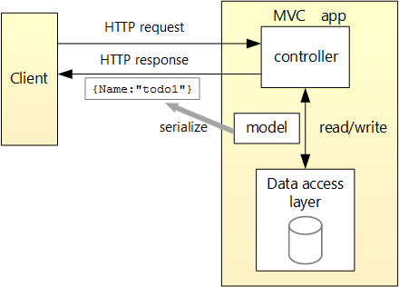

# HTTP API

## 1. 컨트롤러 기반 API와 최소 API 중 선택

ASP.NET Core API를 만드는 방법에는 컨트롤러 기반 API와 최소 API 두 가지가 있다. 컨트롤러는 MVC의 ControllerBase에서 파생된 클래스를 사용한 방법이고, 최소 API는 람다 또는 메서드에서 논리 처리기를 사용하여 엔드포인트를 정의하는 방법이다. 

최소 API에는 컨트롤러 기반 API와 동일한 기능이 많이 있다. 여러 API로 스케일링하고, 복잡한 경로를 처리하고, 권한 부여 규칙을 적용하고, API 응답의 콘텐츠를 제어하는 데 필요한 구성 및 사용자 지정을 지원한다. 따라서 최소 API를 사용하면 가볍고 간단하게 API를 구성할 수 있다는 장점이 있다.

그러나 아직 최소 API에서 아직 지원되거나 구현되지 않은 기능들도 아래와 같이 존재한다.
- 모델 바인딩에 대한 기본 제공 지원이 없다. (사용자 지정 바인딩 shim을 사용하여 지원을 추가할 수 있다.)
- 유효성 검사를 기본적으로 지원하지 않는다.
- 어플리케이션 파트 또는 어플리케이션 모델을 지원하지 않는다. (자체 규칙을 적용하거나 빌드 할 수 있는 방법이 없다.)
- 기본 제공 뷰 렌더링을 지원하지 않는다.
- JsonPatch를 지원하지 않는다.
- OData를 지원하지 않는다.

따라서 위 기능들이 필요하지 않다면 최소 API를 선택하고, 필요하다면 컨트롤 기반 API를 선택하는 것이 좋다.

### 1-0. 공통으로 사용하는 모델 클래스
#### Model.cs

    public class WeatherForecast
    {
        public DateOnly Date { get; set; }
        public int TemperatureC { get; set; }
        public int TemperatureF => 32 + (int)(TemperatureC / 0.5556);
        public string? Summary { get; set; }
    }

### 1-1. 컨트롤러를 기반 API
#### Program.cs
    namespace APIWitchControllers;

    public class Program
    {
        public static void Main(string[] args)
            var builder = WebApplication.CreaterBuilder(args);
    
            builder.Services.AddControllers();
            var app = builder.Build();
    
            app.UseHttpsRedirection();
            app.MapControllers();
    
            app.Run();
        }
    }

#### Controller.cs

    using Microsoft.AspNetCore.Mvc;

    namespace APIWitchControllers.Controllers;
    [ApiController]
    [Route("[controller]")]
    public class WeatherForecastController : ControllerBase
    {
        private static readonly string[] Summaries = new[]
        {
            "Freezing", "Bracing", "Chilly", "Cool", "Mild", "Warm", "Balmy", "Hot", "Sweltering", "Scorching"
        };

        private readonly ILogger<WeatherForescastController> _logger;

        public WeatherForecastController(ILogger<WeatherForecastController> logger)
        {
            _logger = logger;
        }

        [HttpGet(Name = "GetWeatherForecast")]
        public IEnumerable<WeatherForecast> Get()
        {
            return Enumerable.Range(1, 5).Select(index => new WeatherForecast
            {
                Date = DateOnly.FromDateTime(DateTime.Now.AddDays(index)),
                TemperatureC = Random.Shared.Next(-20, 55),
                Summary = Summaries[Random.Shared.Next(Summaries.Length)]
            })
            .ToArray();
        }
    }

### 1-2. 최소 API

#### Program.cs
    namespace MinimalAPI;

    public class Program
    {
        public static void Main(string[] args)
        {
            var builder = WebApplication.CreateBuilder(args);

            var app = builder.Build();
            app.UseHttpsRedirection();
            
            var summaries = new[]
            {
                 "Freezing", "Bracing", "Chilly", "Cool", "Mild", "Warm", "Balmy", "Hot", "Sweltering", "Scorching"
            };

            app.MapGet("/weatherforecast", (HttpContext httpContext) => 
            {
                var forecast = Enumerable.Range(1,5).Select(index => 
                    new WeatherForecast
                    {
                        Date = DateOnly.FromDateTime(DateTime.Now.AddDays(index)),
                        TemperatureC = Random.Shared.Next(-20, 55),
                        Summary = summaries[Random.Shared.Next(summaries.Length)]
                    })
                    .ToArray();
                return forecast;
            });

            app.Run();
        }
    }
    

## 2. 컨트롤 기반 API

- Controller가 Endpoint 라우터 관리하면서, 요청에 따라 Service에서 메소드 끌어다 사용
- Model이 데이터의 포맷을 정의
- Service는 Model과 Controller 사이에서 핵심 비즈니스 로직을 정의

## 3. 최소 API
- Controller나 Service를 따로 사용하지 않고 간단하게 구현